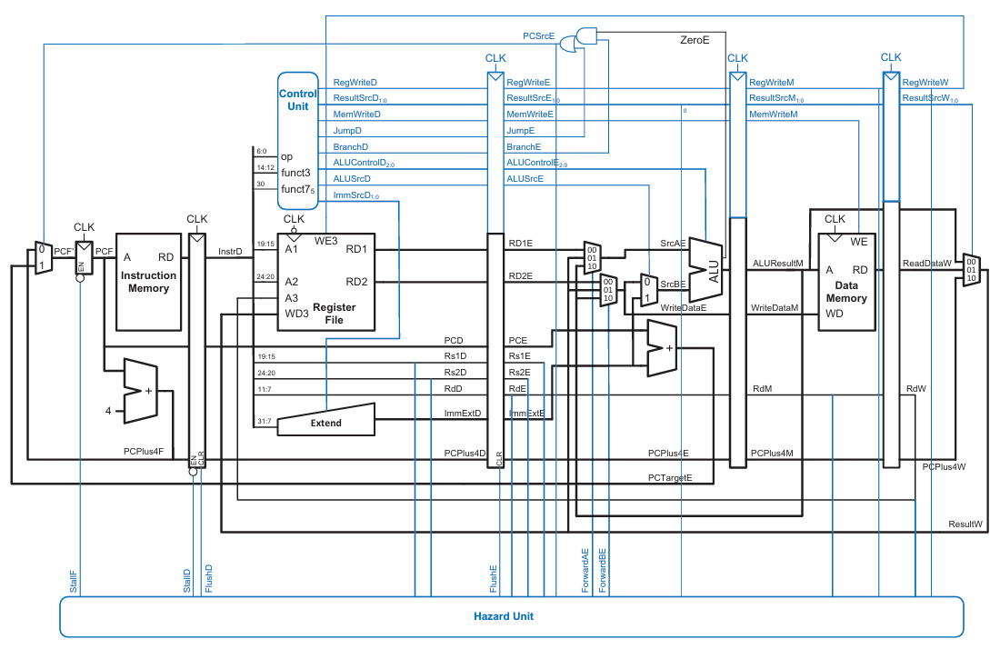

## Pipeline Block Diagram



---

## Features

- **5-stage pipeline**: IF → ID → EX → MEM → WB
- **Full data forwarding**: EX/MEM→EX and MEM/WB→EX paths eliminate most RAW stalls
- **Load-use hazard detection**: 1-cycle stall inserted automatically
- **Control hazard handling**: 2-cycle pipeline flush on taken branches and JAL/JALR
- **Write-through register file**: same-cycle WB→ID bypass prevents WB-stage RAW hazard
- **Active-low synchronous reset** (`rstn`)
- **RV32I instruction subset** (see table below)

---

## Supported Instructions

| Type   | Instructions |
|--------|-------------|
| R-type | `add`, `sub`, `and`, `or`, `xor`, `sll`, `srl`, `sra`, `slt`, `sltu` |
| I-type | `addi`, `andi`, `ori`, `xori`, `slli`, `srli`, `srai`, `slti`, `sltiu` |
| Load   | `lw` |
| Store  | `sw` |
| Branch | `beq`, `bne`, `blt`, `bge`, `bltu`, `bgeu` |
| Jump   | `jal`, `jalr` |
| Upper  | `lui`, `auipc` |

---

## Directory Structure

```
PROJECT/
│
├── src/                      # RTL source files
│   ├── riscv_top.v           # Top-level integration
│   ├── if_stage.v            # Instruction Fetch stage
│   ├── id_stage.v            # Instruction Decode / Register Read stage
│   ├── ex_stage.v            # Execute stage (ALU + branch target)
│   ├── mem_stage.v           # Memory Access stage
│   ├── wb_stage.v            # Write-Back stage
│   ├── pipeline_regs.v       # IF/ID, ID/EX, EX/MEM, MEM/WB registers
│   ├── hazard_unit.v         # Forwarding, stall, and flush control
│   ├── control_unit.v        # Main decoder + ALU decoder
│   ├── main_decoder.v        # Opcode → control signals
│   ├── alu_decoder.v         # funct3/funct7 → ALU operation
│   ├── alu.v                 # 32-bit ALU
│   ├── register_file.v       # 32×32 register file, write-through bypass, x0 hardwired 0
│   ├── imm_extend.v          # Immediate sign-extension (all RV32I types)
│   ├── instruction_memory.v  # ROM (initialised from sim/memfile.hex)
│   ├── data_memory.v         # Single-port RAM
│   ├── pc.v                  # Program counter register
│   ├── adder.v               # 32-bit adder (PC+4, branch target)
│   └── mux.v                 # 2-to-1 and 3-to-1 multiplexers
│
├── sim/                      # Simulation files
│   ├── memfile.hex           # Basic test program (memfile.hex)
│   ├── memfile2.hex          # Comprehensive test program (all instr + explicit hazards)
│   ├── tb_riscv_top.v        # Integration testbench for memfile.hex
│   ├── tb_riscv_top2.v       # Integration testbench for memfile2.hex
│   ├── tb_if_stage.v
│   ├── tb_id_stage.v
│   ├── tb_ex_stage.v
│   ├── tb_mem_stage.v
│   ├── tb_pipeline_regs.v
│   ├── tb_hazard_unit.v
│   ├── tb_register_file.v
│   ├── tb_instruction_memory.v
│   ├── tb_data_memory.v
│   ├── tb_control_unit.v
│   ├── tb_alu.v
│   ├── tb_imm_extend.v
│   ├── tb_alu_decoder.v
│   ├── tb_main_decoder.v
│   ├── tb_wb_stage.v
│   ├── tb_pc.v
│   ├── tb_adder.v
│   └── tb_mux.v
